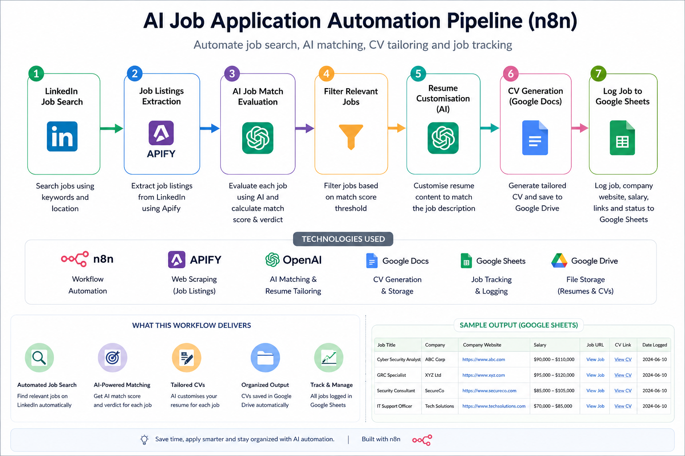
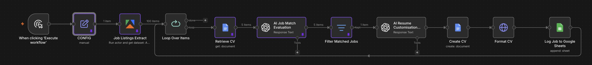
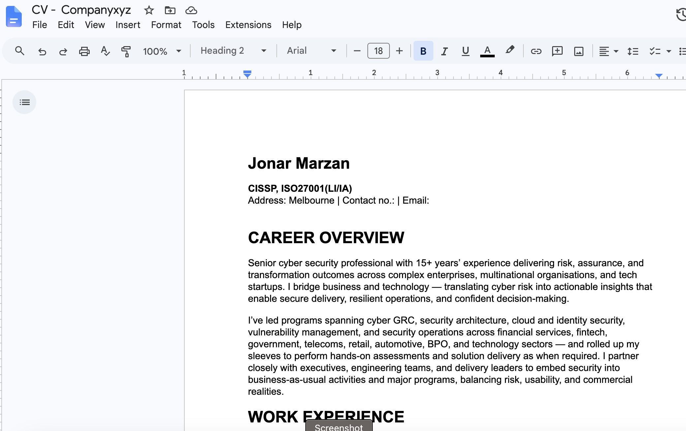
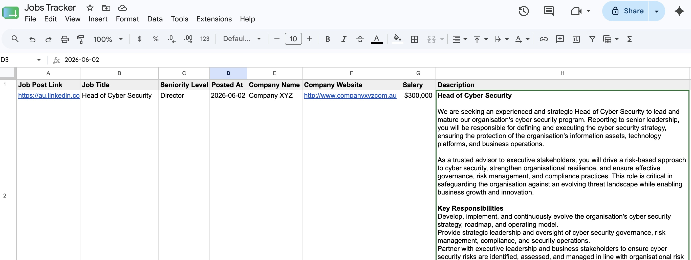

# 🧠 AI Job Application Automation Pipeline (n8n)

An end-to-end AI-powered workflow that automates job searching, AI-based job matching, CV generation and tailoring, and job tracking using n8n, OpenAI, Apify, Google Docs, and Google Sheets.

This workflow is designed to help users automatically find relevant jobs, customise their CV for each role, and log applications in a structured job tracker.

---

# 🚀 Features

- 🔍 Automated job scraping (LinkedIn via Apify)
- 🧠 AI-powered job relevance evaluation 
- 🎯 Smart filtering of job matches
- 📝 AI CV tailoring per job description
- 📄 Google Docs CV generation
- 📊 Google Sheets job tracking system
- 🔁 Fully reusable and configurable workflow

---

# 🏗️ Workflow Overview

1. LinkedIn Job Search
2. Job Listings Extraction (Apify)
3. AI Job Match Evaluation (OpenAI)
4. Filter Relevant Jobs
5. CV Customisation (OpenAI)
6. CV Generation (Google Docs)
7. Job Logging (Google Sheets)

---

# ⚙️ Setup Instructions

## 1. Import Workflow

- Open your n8n instance
- Click **Import Workflow**
- Upload the provided `workflow.json`

---

## 2. Install Required Node (Apify)

If not already installed:

- Go to **n8n Settings → Community Nodes**
- Install:

---

## 3. Add Credentials

You must configure the following credentials in n8n:

### 🔐 Google Drive (OAuth2 API)
- Used for storing CV documents

### 📄 Google Docs (OAuth2 API)
- Used for generating formatted CVs

### 📊 Google Sheets (OAuth2 API)
- Used for logging job applications

### 🤖 OpenAI API
- Used for job matching + CV tailoring  
- You can claim free credits via n8n OpenAI integration (if available in your setup)

### 🧩 Apify API
- Used for LinkedIn job scraping

---

## 4. Configure the CONFIG Node

Open the **CONFIG node** in the workflow and update:

- LinkedIn search URL
- Google Sheet ID (for job tracking)
- Google Docs ID (your Original CV)

📊 Google Sheets Configuration

Before running the workflow, create a Google Sheet that will be used to store job results.

The sheet should already contain the column headers that you want to capture from the workflow. The Log Job to Google Sheets node maps data into these columns.
Example columns:
| Job Post Link | Job Title              | Seniority Level | Posted At  | Company Name | Company Website                            | Salary      | Description | No Applicants | CV URL      | Application URL |
| ------------- | ---------------------- | --------------- | ---------- | ------------ | ------------------------------------------ | ----------- | ----------- | ------------- | ----------- | --------------- |
| https://...   | Cyber Security Manager | Manager         | 2025-06-01 | Example Corp | [https://example.com](https://example.com) | $180k-$220k | ...         | 25            | https://... | https://...     |

**Notes
* You may customise the columns based on your requirements.
* If you add, remove, or rename columns, you may need to update the mappings in the Log Job to Google Sheets node.
* After modifying columns, open the Log Job to Google Sheets node and click Refresh Fields to reload the Google Sheet schema.
* If fields do not map automatically, manually map the values from the Job Listings Extract node to the appropriate Google Sheet columns.
---

# ▶️ Running the Workflow

- Click **Execute Workflow**
- The system will:
  - scrape jobs
  - evaluate relevance
  - generate tailored CVs in Google Drive
  - log results in Google Sheets

---

# ⚠️ Troubleshooting

## 🧾 Issue: “Log Job to Google Sheets” node error

If you encounter an error in:

> **Log Job to Google Sheets (final node)**

### Fix:

1. Open the node
2. Go to **“Values to Send”**
3. Click **“Refresh Fields”**
4. Manually map fields from:
   - **Job Listings Extract node output**

Example mappings:
- Job Title → `title`
- Company → `company`
- Job URL → `url`
- AI Verdict → `verdict`

---

# 📌 Notes

- Do NOT hardcode API keys inside nodes
- Always use the CONFIG node for URLs and IDs
- Ensure Google OAuth credentials are active before running workflow

---

# 🧠 Recommended Improvements

- Add job scoring system (0–100)
- Add email notifications for high-match jobs
- Add duplicate job filtering
- Add CV version tracking

---

# ⚖️ License

This project is licensed under **Creative Commons Attribution-NonCommercial 4.0 International (CC BY-NC 4.0)**.

You are free to:
- Use
- Modify
- Share

You are NOT allowed to:
- Sell
- Use commercially without permission

---

# 🤝 Contribution

Feel free to fork this repository and improve the workflow. If you build enhancements, contributions are welcome.
